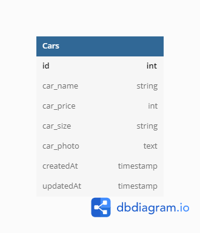
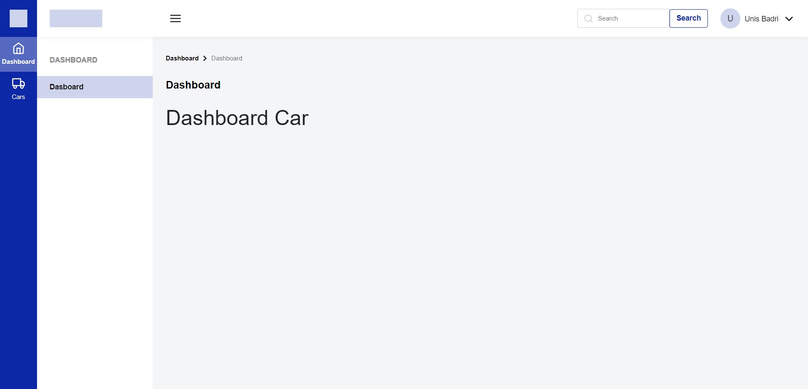
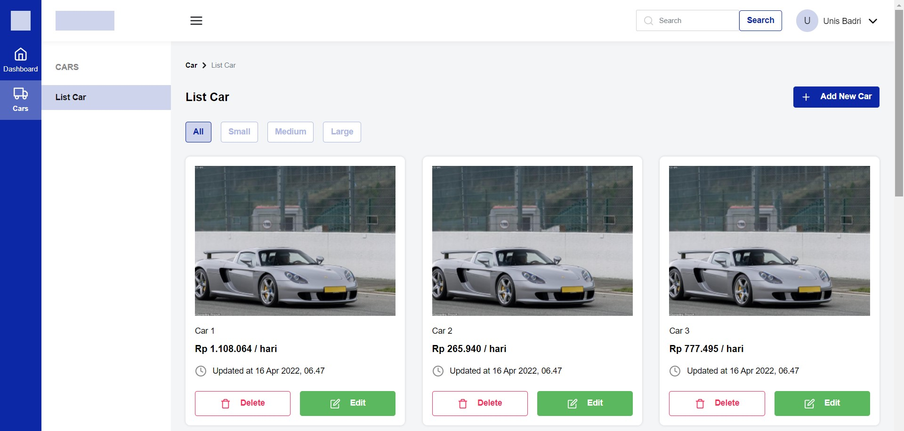
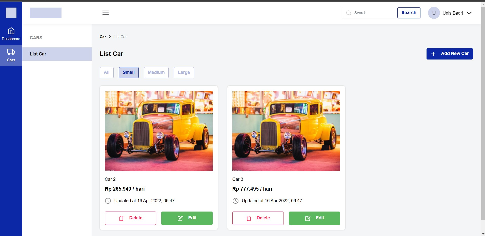
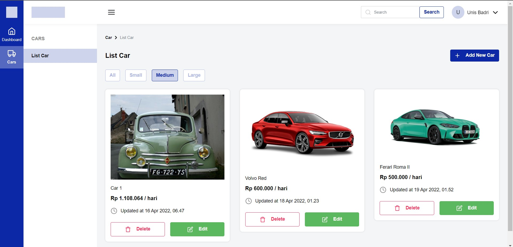
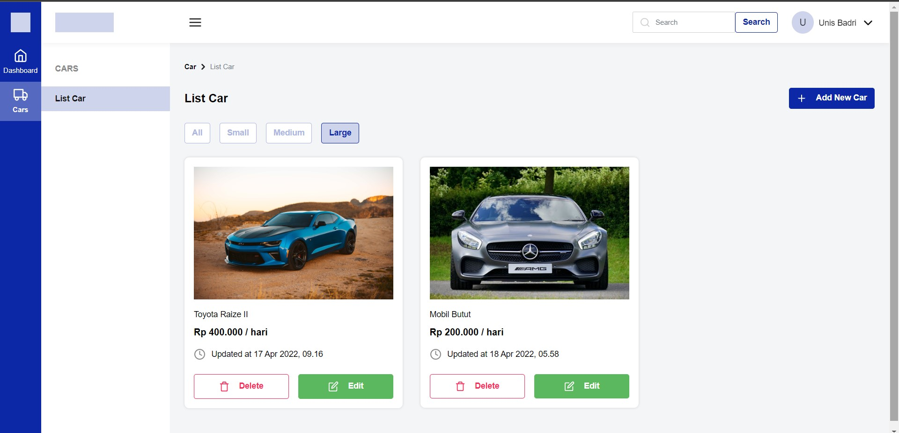
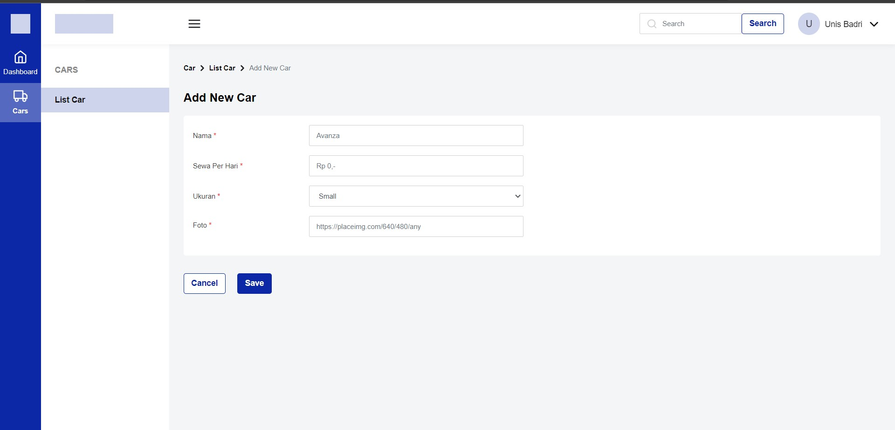
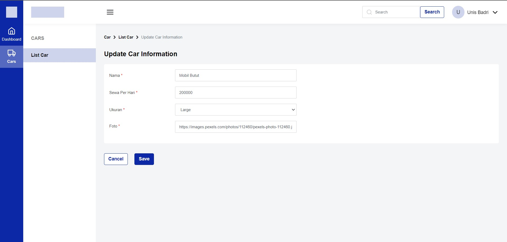

<div id="top"></div>

<br />
<div align="center">
  <h3 align="center">Challenge 5 Binar Fullstack Web</h3>
  <p align="center">Car Management Dashboard</p>
</div>

<!-- ABOUT THE PROJECT -->

## The Project

- DB Diagram
  <br>
  

- Page Dashboard
  <br>
  

- Page Cars
  <br>
  

- Page Filter Cars Size
  <br>
  
  
  

- Page Add Car
  <br>
  

- Page Edit Car
  <br>
  

### Built With

- ExpressJS
- Bootstrap
- Sequelize
- Postgres

<p align="right">(<a href="#top">back to top</a>)</p>

## Getting Started

### Installation

1. Clone the repo
   ```sh
   https://github.com/micjef/binar-car-management-dashboard.git
   ```
2. Install packages
   ```sh
   yarn install || npm i
   ```
3. Next Step

   ```sh
   - salin config.example.json dan beri nama config.json
   - setting config.json dengan username, password, dan database yang digunakan

   - sequelize db:migrate
   - sequelize db:seed:all
   ```

4. Run
   ```sh
   yarn start || npm run start
   ```

<p align="right">(<a href="#top">back to top</a>)</p>

## Info

- Get all cars : GET <code>/cars</code>
- Create a car : POST <code>/cars/create</code>
- Update a car : PUT <code>/cars/update/:id</code>
- Delete a car : DELETE <code>/cars/delete/:id</code>

- Filter size car : GET <code>/cars/search/?car_size=</code>
- Search cars by name and size : GET <code>/cars/search/?q=</code>

<p align="right">(<a href="#top">back to top</a>)</p>

## License

Distributed under the MIT License. See `LICENSE.txt` for more information.